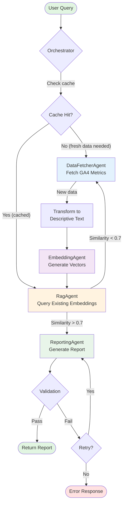

# Agent Dependency DAG (Directed Acyclic Graph)

## Overview

This document defines the dependency graph and execution flow for the multi-agent GA4 analytics system. It specifies which agents can run in parallel, sequential dependencies, and conditional branching logic to optimize performance while maintaining data consistency.

## Agent System Architecture

### Agents in the System

1. **DataFetcherAgent** - Fetches GA4 metrics from Google Analytics API
2. **EmbeddingAgent** - Generates vector embeddings from GA4 data
3. **RagAgent** - Retrieves relevant context using vector similarity search
4. **ReportingAgent** - Generates final analytics report for user

## Dependency DAG



## Execution Modes

### Mode 1: Fresh Data Path (No Cache)

**Flow:**
```
User Query
  → DataFetcherAgent (fetch from GA4 API)
  → Transform raw JSON to descriptive text
  → EmbeddingAgent (generate 1536D vectors)
  → Store in ga4_embeddings table
  → RagAgent (similarity search)
  → ReportingAgent (generate report)
  → Return to user
```

**Duration:** ~3-5 seconds
- DataFetcher: 500-1000ms (GA4 API latency)
- Transform: 100-200ms
- Embedding: 200-500ms (OpenAI API)
- RAG: 50-100ms (pgvector search)
- Reporting: 1500-2500ms (LLM generation)

### Mode 2: Cached Data Path

**Flow:**
```
User Query
  → Check cache (Redis/PostgreSQL)
  → RagAgent (query existing embeddings)
  → ReportingAgent (generate report)
  → Return to user
```

**Duration:** ~1-2 seconds
- Cache check: 10-20ms
- RAG: 50-100ms
- Reporting: 1500-2500ms

### Mode 3: Hybrid Path (Low Similarity)

**Flow:**
```
User Query
  → RagAgent (query existing embeddings)
  → Similarity < 0.7 threshold
  → DataFetcherAgent (refresh data)
  → EmbeddingAgent (generate new vectors)
  → RagAgent (re-query with new data)
  → ReportingAgent (generate report)
  → Return to user
```

**Duration:** ~4-6 seconds (includes retry logic)

## Parallelization Rules

### ✅ Can Run in Parallel

#### 1. Initial RAG + Data Fetch (Opportunistic)
```python
# Check existing embeddings while fetching fresh data
results = await asyncio.gather(
    rag_agent.retrieve(query),        # Query existing embeddings
    data_fetcher.fetch(property_id)   # Fetch fresh GA4 data (if needed)
)
```

**Rationale:**
- RAG queries historical embeddings (read-only)
- DataFetcher calls external GA4 API (independent)
- No shared state or race conditions
- Allows "best of both" approach

#### 2. Multiple Embedding Generations (Batch)
```python
# Generate embeddings for multiple metrics in parallel
embeddings = await asyncio.gather(*[
    embedding_agent.generate(text)
    for text in batch_texts
])
```

**Rationale:**
- OpenAI API supports concurrent requests
- Each embedding generation is independent
- Dramatically improves throughput for large datasets

### ❌ Cannot Run in Parallel (Sequential Dependencies)

#### 1. DataFetcher → Embedding
```python
# MUST wait for data before generating embeddings
data = await data_fetcher.fetch()
embeddings = await embedding_agent.generate(data.descriptive_text)
```

**Rationale:**
- Embedding requires transformed text from DataFetcher
- Data dependency (output → input)

#### 2. Embedding → RAG (for fresh data)
```python
# MUST wait for embeddings to be stored before querying
await embedding_agent.generate_and_store(data)
results = await rag_agent.retrieve(query)
```

**Rationale:**
- RAG searches the ga4_embeddings table
- New vectors must be indexed before search
- Database consistency requirement

#### 3. RAG → Reporting
```python
# MUST wait for context before generating report
context = await rag_agent.retrieve(query)
report = await reporting_agent.generate(query, context)
```

**Rationale:**
- ReportingAgent needs retrieved context
- Context provides grounding for LLM response

## Conditional Branching Logic

### Condition 1: Cache Hit
```python
if cached_result := await cache.get(cache_key):
    # Skip DataFetcher and Embedding
    return await reporting_agent.generate(query, cached_result)
else:
    # Execute full pipeline
    return await full_pipeline(query)
```

**Decision Criteria:**
- Cache key: `hash(tenant_id + property_id + query + date_range)`
- TTL: 1 hour for real-time queries, 24 hours for historical
- Invalidation: On data refresh or user request

### Condition 2: RAG Similarity Threshold
```python
rag_results = await rag_agent.retrieve(query)

if rag_results.max_similarity < 0.7:
    # Low confidence - refresh data
    fresh_data = await data_fetcher.fetch()
    await embedding_agent.generate_and_store(fresh_data)
    rag_results = await rag_agent.retrieve(query)

return await reporting_agent.generate(query, rag_results)
```

**Decision Criteria:**
- Threshold: 0.7 cosine similarity
- Rationale: Below 0.7 indicates query mismatch or stale data
- Action: Trigger fresh data fetch to improve quality

### Condition 3: Quota Exhausted
```python
try:
    await quota_manager.acquire_quota()
    data = await data_fetcher.fetch_from_ga4()
except GA4QuotaExceededError:
    # Fallback to cached data or embeddings
    logger.warning("Quota exhausted, using cached data")
    data = await cache.get_latest()
    if not data:
        raise ServiceUnavailableError("No cached data available")
```

**Decision Criteria:**
- Hourly limit: 50 requests per property
- Daily limit: 200 requests per property
- Action: Graceful degradation to cached data

## Error Handling & Recovery

### Circuit Breaker Pattern

```python
class AgentCircuitBreaker:
    """Per-agent circuit breaker to prevent cascading failures."""
    
    states = ["CLOSED", "OPEN", "HALF_OPEN"]
    failure_threshold = 5  # Open after 5 consecutive failures
    timeout = 60  # Reset to HALF_OPEN after 60 seconds
```

**Agent-Specific Breakers:**

| Agent | Failure Threshold | Timeout | Fallback |
|-------|------------------|---------|----------|
| DataFetcherAgent | 5 failures | 60s | Use cached metrics |
| EmbeddingAgent | 3 failures | 30s | Skip embedding, use existing |
| RagAgent | 10 failures | 30s | Return empty context (LLM only) |
| ReportingAgent | 3 failures | 60s | Return raw data with warning |

### Retry Strategy

```python
@retry(
    stop=stop_after_attempt(3),
    wait=wait_exponential(multiplier=1, min=2, max=10),
    retry=retry_if_exception_type(TransientError)
)
async def fetch_with_retry():
    return await data_fetcher.fetch()
```

**Retry Configuration:**
- Attempts: 3
- Backoff: 2s, 4s, 8s (exponential)
- Retry on: Network errors, rate limits, timeouts
- Don't retry: Authentication errors, invalid property ID

## Performance Optimization

### 1. Opportunistic Parallelism
```python
# Start RAG early while DataFetcher runs
async with TaskGroup() as tg:
    rag_task = tg.create_task(rag_agent.retrieve(query))
    
    # Check if fresh data needed
    if should_refresh_data(cache_age):
        data_task = tg.create_task(data_fetcher.fetch())
    
# Use whichever completes first for initial response
```

### 2. Streaming Responses
```python
async def stream_report(query: str):
    # Stream partial results as they become available
    yield {"status": "fetching_data", "progress": 0.2}
    
    data = await data_fetcher.fetch()
    yield {"status": "generating_embeddings", "progress": 0.4}
    
    embeddings = await embedding_agent.generate(data)
    yield {"status": "retrieving_context", "progress": 0.6}
    
    context = await rag_agent.retrieve(query)
    yield {"status": "generating_report", "progress": 0.8}
    
    async for chunk in reporting_agent.stream_generate(query, context):
        yield {"type": "report_chunk", "content": chunk}
```

### 3. Batch Processing
```python
# Process multiple queries in a single embedding batch
queries = ["query1", "query2", "query3"]
embeddings = await embedding_agent.batch_generate([
    transform_query(q) for q in queries
])
```

## Race Condition Prevention

### Scenario 1: Concurrent Embedding Generation
**Problem:** Two users query same metric simultaneously
```
User A: Query "mobile conversions" → Start embedding generation
User B: Query "mobile conversions" → Start embedding generation (duplicate)
Result: Wasted API calls and potential data inconsistency
```

**Solution:** Distributed lock with Redis
```python
async def generate_embedding_with_lock(text: str):
    lock_key = f"embedding_lock:{hash(text)}"
    
    async with redis_lock(lock_key, timeout=30):
        # Check if embedding exists (double-check pattern)
        if existing := await db.get_embedding(text):
            return existing
        
        # Generate new embedding
        return await embedding_agent.generate(text)
```

### Scenario 2: RAG Query During Embedding Storage
**Problem:** RAG queries while embeddings are being written
```
Thread 1: Insert embedding into ga4_embeddings table
Thread 2: RAG query executes before index update
Result: New embeddings not found in search results
```

**Solution:** Transactional embedding storage
```python
async with db.transaction():
    # Insert embedding
    await db.insert_embedding(embedding)
    
    # Refresh index (within same transaction)
    await db.execute("REFRESH MATERIALIZED VIEW embedding_index")
    
# RAG queries after this point will see new embeddings
```

## Monitoring & Observability

### Key Metrics

1. **Agent Execution Time**
   - `agent_execution_seconds{agent="DataFetcherAgent"}`
   - P50, P95, P99 latencies

2. **Parallelization Efficiency**
   - `parallel_tasks_executed_total`
   - `sequential_tasks_executed_total`
   - Ratio indicates optimization opportunities

3. **Circuit Breaker State**
   - `circuit_breaker_state{agent="...", state="OPEN|CLOSED|HALF_OPEN"}`
   - Alert when agents stuck in OPEN state

4. **Retry Count**
   - `agent_retry_count{agent="...", success=true|false}`
   - High retry count indicates upstream issues

### Tracing

```python
with tracer.start_span("orchestrator_pipeline") as span:
    span.set_attribute("query", query)
    
    with tracer.start_span("data_fetcher"):
        data = await data_fetcher.fetch()
    
    with tracer.start_span("embedding_agent"):
        embeddings = await embedding_agent.generate(data)
    
    # ... continues for all agents
```

## References

- Task P0-1: Agent Implementation & Orchestrator Integration
- Task P0-18: Agent Handoff Orchestration Logic
- Task P0-23: Agent Orchestration State Machine Implementation
- Task P0-41: Parallel Agent Executor with Circuit Breakers
- ADR-001: Agent Framework Unification (Pydantic-AI)
- ADR-002: Agent Parallelization Strategy (this document's ADR)

